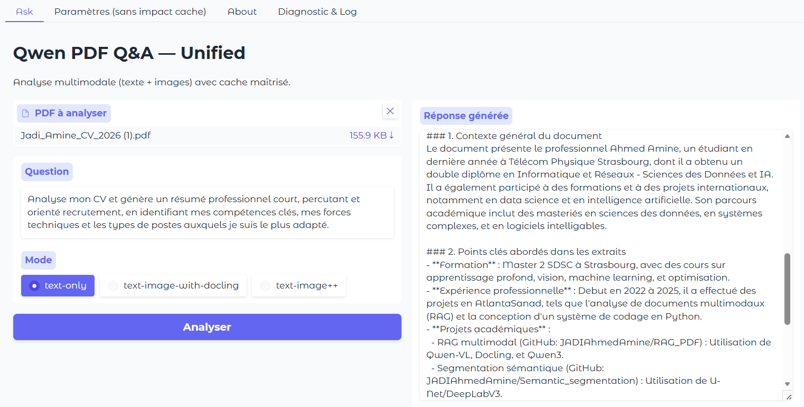
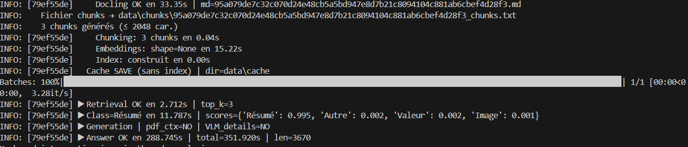
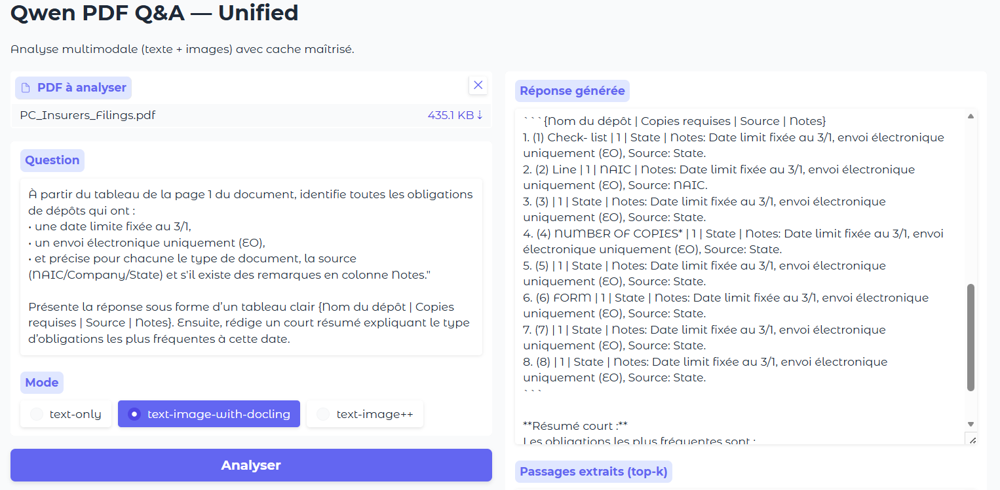
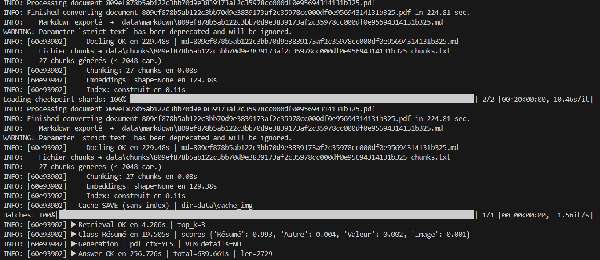

# 📄 RAG_PDF — Pipeline RAG multimodal pour l’analyse de PDF (Qwen)


**RAG_PDF** est un pipeline **RAG (Retrieval-Augmented Generation)** multimodal pour analyser des **PDF non structurés**  
(texte, tableaux, graphiques, schémas) et répondre à des questions en **langage naturel**, avec une UI Gradio et des mécanismes de **cache**.

Il combine **Docling** (extraction), **Qwen3** (embeddings + génération), **CLIP** (sélection d’images) et **Qwen-VL** (raisonnement visuel).  
Tout le traitement est **local** par défaut.


---

## 

Ce projet met en avant une maîtrise complète d’une chaîne **document AI** orientée production :

- **Extraction PDF** réaliste et structurée.
- **RAG multimodal** (texte + tableaux + figures).
- **Recherche sémantique** + **reranking** pour la pertinence.
- **Intégration VLM** pour raisonner sur graphiques/schémas.
- **Ingénierie solide** : architecture modulaire, caching, logs, UI unifiée.

---

##  Fonctionnalités

- **Extraction PDF robuste** → Markdown (texte + tableaux + *captions d’images*).
- **Chunking intelligent** conservant tables & légendes.
- **Recherche sémantique** (embeddings Qwen3 + FAISS/KNN + *rerank* cross-encoder).
- **Vision-LLM** (Qwen-VL quantisé 4-bit, fallback GPU/CPU).
- **Sélection d’images zero-shot** (CLIP) : `chart / table / diagram / flowchart`.
- **UI Gradio unifiée** avec logs, diagnostic JSON et export Markdown.
- **Caches** séparés par mode + nettoyage auto des images temporaires.


## Organisation

```
qwenpdf_insight/
├── app/                       # Interface Gradio unifiée
│   └── qwen_interface_unified.py
├── pipeline/
│   ├── cache_manager.py
│   ├── extract/
│   │   ├── extract_with_docling.py
│   │   └── extract_with_docling_img.py
│   ├── embedding/qwen_embedding.py
│   ├── generation/generate_qwen_answer.py
│   └── multimodal/image_qa_pipeline.py
├── scripts/
│   ├── launch_gradio.py
│   ├── launch_gradio_img.py
│   └── launch_unified.py         # ← script de lancement recommandé
├── data/
│   ├── uploads/    # PDF (hashés)
│   ├── markdown/   # Exports Docling
│   ├── chunks/     # Chunks concaténés
│   ├── cache/      # cache (text-only)
│   ├── cache_img/  # cache (text-image & ++)
│   ├── images/     # figures/rendu (temp)
│   └── logs/       # interface_log.txt
├── requirements.txt
├── LICENSE
└── README.md
```

---

##  Prérequis

- **OS** : Linux, macOS, Windows 10/11
- **Python** : 3.10+
- **GPU (optionnel)** : CUDA 11.8+ recommandé pour Qwen-VL 4-bit
- **Disk** : prévoir de l’espace pour `data/` (exports, caches, images)

---

##  Installation

```bash
git clone https://github.com/JADIAhmedAmine/RAG_PDF.git
cd qwenpdf_insight
python -m venv .venv && source .venv/bin/activate     # PowerShell: .venv\Scripts\Activate.ps1
pip install -r requirements.txt
```

Connexion Hugging Face si besoin :

```bash
huggingface-cli login
```

### Modèles utilisés

- `Qwen/Qwen3-Embedding-0.6B`
- `Qwen/Qwen3-0.6B` (ou `Qwen/Qwen3-0.6B-Chat`)
- `cross-encoder/ms-marco-MiniLM-L-6-v2`
- `laion/CLIP-ViT-B-32-laion2B-s34B-b79K`
- `Qwen/Qwen2.5-VL-3B-Instruct`

---

## ▶ Lancement

### Windows (PowerShell / CMD)

```bash
py .\scripts\launch_unified.py
```

### Linux / macOS

```bash
python scripts/launch_unified.py
```

**Modes** (sélection dans l’UI) :
- `text-only` — plus rapide, 100% textuel.
- `text-image-with-docling` — ajoute *captions* d’images (sans VLM).
- `text-image++` — multimodal complet (extraction figures → CLIP → Qwen-VL).

**Sorties UI** : réponse générée, passages *Top-k*, résumé VLM (mode ++), galerie d’images, log téléchargeable, export **Markdown**.

---

##  Paramètres utiles (sans casser le cache)

- `k_images = 4` — nb d’images passées à Qwen-VL  
- `min_prob = 0.18` — seuil CLIP  
- `page_dpi = 180` — rendu de pages (vectoriels)  
- `extract_full_pages = false` — rendu page entière si besoin  

**Env conseillés**

```bash
# logs console (DEBUG/INFO/WARNING/ERROR)
export LOGLEVEL=INFO
# limiter la fragmentation CUDA
export PYTORCH_CUDA_ALLOC_CONF=expandable_segments:True
```

---

##  Caching & perfs

| Mode                      | Extraction Docling                     | Cache embeddings | Dossier cache    | VLM Qwen-VL       | Images persistées        |
|---------------------------|----------------------------------------|------------------|------------------|-------------------|--------------------------|
| `text-only`               | Texte + tableaux                       | ✅                | `data/cache`     | ❌                 | —                        |
| `text-image-with-docling` | Texte + tableaux + *captions*          | ✅                | `data/cache_img` | Auto (si requise) | `data/images/<hash>`     |
| `text-image++`            | Idem + **force VLM**                   | ✅ (texte)        | `data/cache_img` | ✅ (forcée)        | Non (nettoyage auto)     |

**Clé de cache** : hash **SHA-256** du PDF (géré par `EmbeddingCacheManager`). L’index est **reconstruit** à la volée depuis les embeddings.

---
---

##  Exemple d’exécution — Analyse automatique de CV

Chargement du PDF → extraction → résumé orienté recrutement  
Génération d’un profil professionnel court + points forts + sugg. de postes

<p align="center">
  
</p>

---
### Exemple d'exécution interne (Debug Pipeline)

Cet extrait illustre le fonctionnement complet du pipeline lors d’une analyse de document.
On observe clairement les étapes successives du traitement RAG :

1. **Extraction PDF (Docling)** → conversion en Markdown structuré  
2. **Chunking** → segmentation du contenu en blocs exploitables  
3. **Embeddings (Qwen3)** → vectorisation pour la recherche sémantique  
4. **Retrieval Top-K** → sélection des passages pertinents  
5. **Classification de la requête** (ici → Résumé CV, confiance = 0.995)  
6. **Génération finale** → réponse complète basée uniquement sur le document

> Ce log montre que le système comprend le type de tâche demandé, récupère les
> bons passages, puis génère un résumé structuré et exploitable.

<p align="center">
  
</p>
---

##  Extraction & analyse ciblée d’un tableau (PDF réel)

Voici un test effectué sur *PC_Insurers_Filings.pdf*.  
L’objectif était de filtrer un tableau réglementaire selon des critères précis :

 **Question demandée au modèle :**

> À partir du tableau page 1, extraire uniquement les dépôts qui :  
> • ont une date limite fixée au **3/1**  
> • sont soumis en **EO (Electronic-Only)**  
> • en fournissant : **Nom du dépôt | Source | Copies requises | Notes**

 **Résultat généré automatiquement**

<p align="center">
  
</p>

Le modèle a correctement reconstruit les lignes du tableau, filtré les dépôts correspondants à la date **3/1**,  
identifié que la plupart sont gérés via **envoi électronique (EO)** et a précisé l’origine des exigences (State / NAIC).

**Résumé automatique extrait par le pipeline :**

> Les dépôts attendus au 3/1 sont majoritairement des fichiers EO.  
> La plupart proviennent des autorités *State level*, avec plusieurs séries répétées, indiquant un flux administratif standardisé.
---

##  Debug complet — Analyse d’un PDF avec tableau (PC_Insurers_Filings.pdf)

Cette exécution montre le fonctionnement interne du pipeline sur un PDF réel de type réglementaire.  
On visualise clairement chaque étape du traitement : extraction, chunking, embeddings, indexation, retrieval, classification, génération.

<p align="center">
  
</p>

###  Déroulement visible dans les logs

| Étape | Détails | Temps |
|---|---|---|
| Docling PDF → Markdown | Extraction du tableau + contenu brut | ~229s |
| Chunking | Segmentation en 27 blocs ≤ 2048 tokens | 0.08s |
| Embeddings Qwen3 | Génération + vectorisation | ~129s |
| Index FAISS | Construction instantanée | 0.11s |
| Retrieval Top-3 | Recherche des lignes pertinentes | 4.2s |
| Classification de requête | `Résumé`: **0.993** → tâche détectée automatiquement | 19.5s |
| Réponse finale | Synthèse + format structuré | 256.7s |
| **Durée complète du pipeline** | 639.6s | ⬅ exécution multimodale lourde |

*Le pipeline identifie automatiquement que la requête correspond à un résumé tabulaire (`classifier_score=0.993`) — preuve qu’il comprend la nature de la tâche.*

---

### Ce que ce log prouve techniquement

| Compétence du système | ✔ Validée |
|---|:---:|
| Traitement de PDF complexe | ✔ |
| Conversion en Markdown + chunks structurés | ✔ |
| Embeddings + indexation vectorielle | ✔ |
| Récupération top-k + classification intelligente | ✔ |
| Résumé automatique exploitable | ✔ |


---

---

## 📄 Documents PDF utilisés pour les tests

Pour assurer la reproductibilité complète, voici les fichiers PDF utilisés dans les exemples du README.  
Ils sont disponibles dans le repository pour permettre à d'autres utilisateurs de tester le pipeline eux-mêmes.

| PDF | Contenu | Lien |
|---|---|---|
| `PC_Insurers_Filings.pdf` | Tableau réglementaire + choix multiples (Source/Notes/EO) | 🔗 [Télécharger](docs/pdfs/PC_Insurers_Filings.pdf) |
| `Jadi_Amine_CV_2026 (1).pdf` | CV_fichier_textuel| 🔗 [Télécharger](docs/pdfs/Jadi_Amine_CV_2026(1).pdf) |


> Chaque fichier peut être ouvert et analysé directement via l’interface RAG_PDF.

---

##  Données & sécurité

- Traitement **local** par défaut (pas d’envoi cloud non configuré).  
- Les PDFs sont renommés par hash dans `data/uploads/`.  
- Pensez à ignorer `data/` dans Git :

```gitignore
data/
*.log
*.cache
```

---

##  Exemple d’utilisation (placeholders)

Place tes captures d’écran dans `docs/screenshots/` :

- `docs/screenshots/ui_upload.png` — Upload + choix du mode  
- `docs/screenshots/ui_response.png` — Réponse + top-k + résumé VLM  

---

## 👤 Auteur

**Ahmed Amine Jadi** — 2025  
Stage ingénieur — *AtlantaSanad Assurance*

- GitHub : https://github.com/JADIAhmedAmine
- LinkedIn : https://www.linkedin.com/in/ahmed-amine-jadi-958010373/  
- Email : amine_jadon@outlook.fr

---

##  Licence

MIT — voir `LICENSE`.
